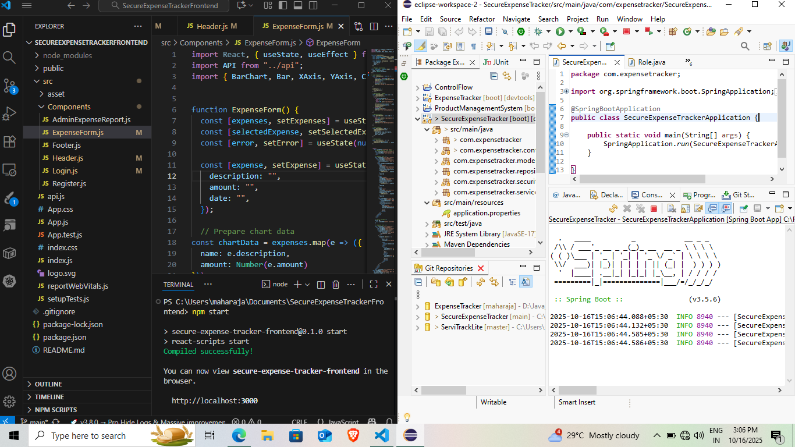
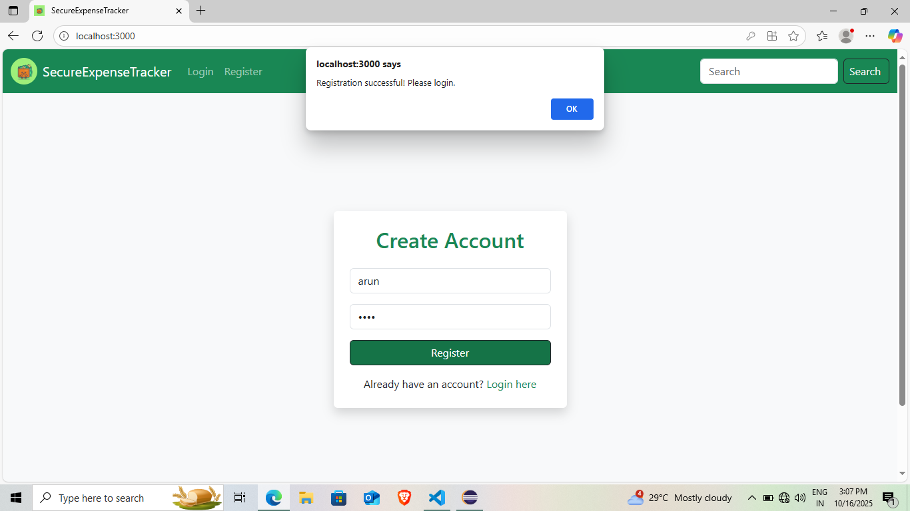
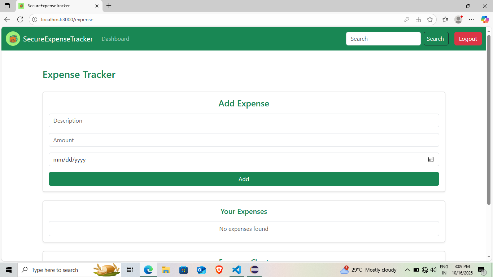
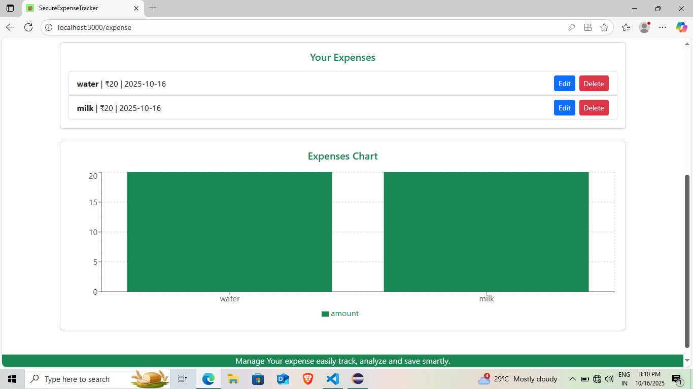
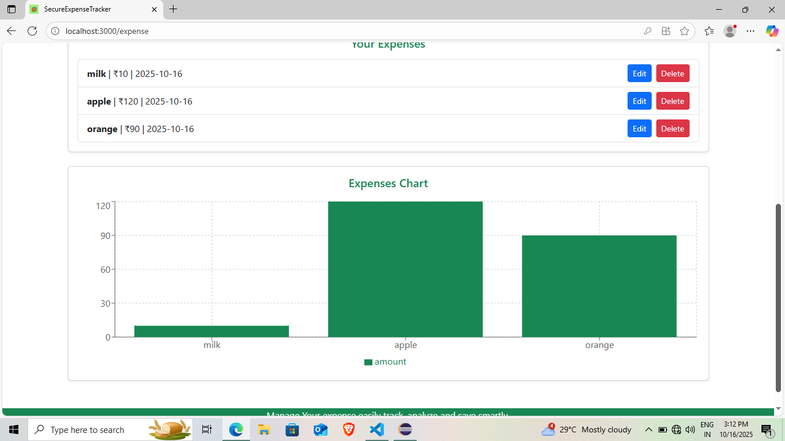
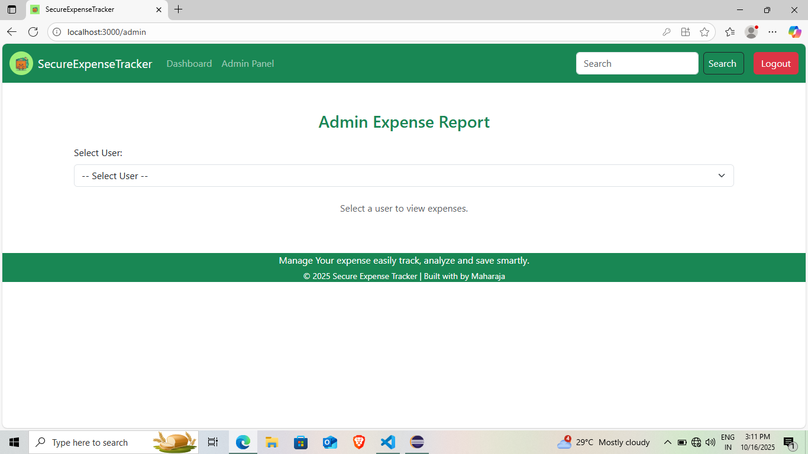
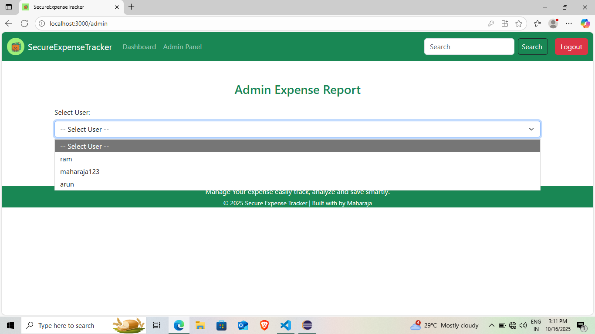
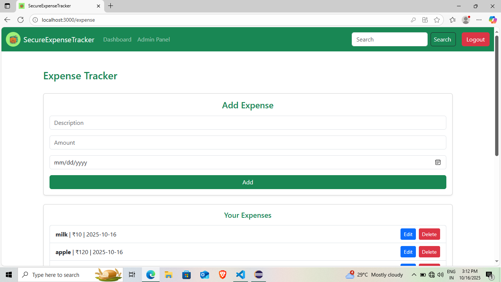

# 🛡️ SecureExpenseTracker

<p align="center">
  
</p>

<p align="center">
  <em>A secure, full-stack expense management application with JWT-based authentication and role-based access control.</em>
</p>

---

## 📖 About the Project

**SecureExpenseTracker** is a complete web application designed to help users **track daily expenses** securely.
It features **user authentication**, **role-based access**, and **visual analytics** to help users manage their finances efficiently.

Admins can monitor all users and generate expense reports, while regular users can view and manage only their own data.

---

## 🚀 Key Features

✅ User Registration & Login using JWT Authentication
✅ Role-based Access (Admin / User)
✅ Add, Edit, Delete Expenses
✅ Monthly Expense Charts (Bar/Line Graphs)
✅ Responsive UI for all devices
✅ Secure REST API built with Spring Boot
✅ Database integration using JPA and MySQL

---

## 🛠️ Tech Stack

| Layer              | Technology Used                     |
| ------------------ | ----------------------------------- |
| **Frontend**       | ReactJS, Axios, Bootstrap, Recharts |
| **Backend**        | Spring Boot, JPA, Hibernate         |
| **Database**       | MySQL                               |
| **Authentication** | JSON Web Token (JWT)                |
| **Tools**          | VS Code, IntelliJ IDEA, Postman     |

---

## 📂 Project Structure

```
SecureExpenseTracker/
│
├
├── frontend/               # ReactJS application
│   ├── src/components/     # Components (Login, Dashboard, Expenses)
│   ├── src/api/            # API configuration
│   └── public/assets/      # Images and icons
│
├── README.md               # Project Documentation
└── ...
```

---

## ⚙️ Setup & Installation


### 🧩 1. Run Backend (Spring Boot)

```bash
cd backend
mvn spring-boot:run
```

Backend will run on:
➡️ `http://localhost:8080`

---

### 🧩 2. Run Frontend (ReactJS)

```bash
cd frontend
npm install
npm start
```

Frontend will run on:
➡️ `http://localhost:3000`

---

## 📸 Screenshots

### 👨‍💻 Project Run

<p align="center">
  
</p>

### 🔐 Login Page

<p align="center">
  
</p>
<p align="center">

</p>
### 📊 Dashboard

<p align="center">
  
</p>
<p align="center">
  
</p>
<p align="center">
  
</p>
<p align="center"><em>Track your expenses with interactive charts and reports.</em></p>

---
### 📊 Admin Dashboard
<p align="center">
  
</p>
<p align="center">
  
  </p>
  <p align="center">
  
  </p>
  <p align="center">
  
</p>
---
## 🔒 Security Highlights

* Encrypted password storage (BCrypt)
* JWT-based authentication for secure API access
* Role-based authorization (Admin/User)
* CORS configuration for safe cross-origin communication

---

## 👨‍💻 Author

**MAHARAJA R**
📧 [mayamaharaja18@example.com](mailto:mayamaharaja18@example.com)
🌐 [Portfolio](https://maharaja77.github.io/maharaja/)
💼 [LinkedIn](https://www.linkedin.com/in/maharajaofficial)
🌐 [YouTube Channel](https://www.youtube.com/@tech_for_tech_world)

---


